# Operationalizing Machine Learning

## Table of Content
* [Overview of the project](#overview)
* [Project main steps](#Project_main_steps)
* [Key Steps](#architectural-diagram)
    * [Authentication](#authentication)
    * [Automated ML Experiment](#automated-ml-experiment)
    * [Deploy the best model](#deploy-the-best-model)
    * [Enable logging](#enable-logging)
    * [Swagger Documentation](#swagger-documentation)
    * [Consume model endpoints](#consume-model-endpoints)
    * [Create and publish a pipeline](#create-and-publish-a-pipeline)
* [Screen Recordin](#screen-recording)
* [Standout Suggestions](#standout-suggestions)
* [Future Improvements](#Future_Improvements)
* [Youtube Link](https://www.youtube.com/watch?v=dsJhRnQl4M0)

## Overview of the project
In this project, I used Azure to configure a cloud-based machine learning production to model, deploy, and consume it for the [Marketing Dataset](https://automlsamplenotebookdata.blob.core.windows.net/automl-sample-notebook-data/bankmarketing_train.csv). 

This data includes information about marketing campaings for a bank. I used AutoML for the task of classification to predict if the bank would subscribe for a customer or not. I also created, published, and consumed a pipeline.  

I used the Bank Marketing dataset.  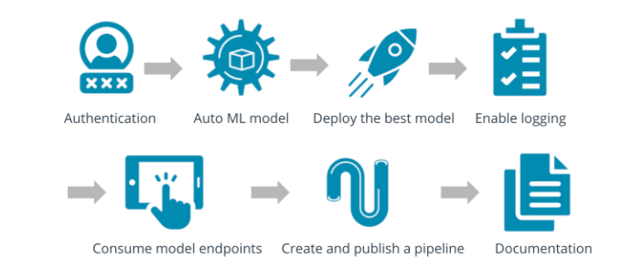 
I used the Bank Marketing dataset.  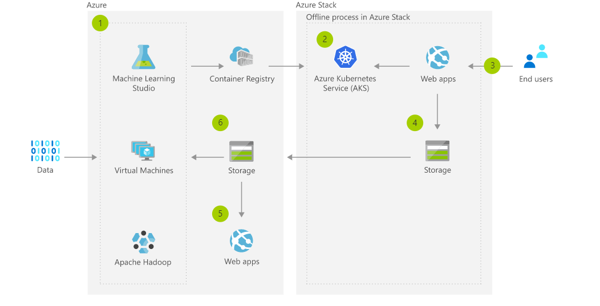 

## Project main steps
Below are the steps I followed in this project:

1. Authentication: In this step, you will need to install the Azure Machine Learning Extension which allows you to interact with Azure Machine Learning Studio, part of the az command. After having the Azure machine Learning Extension, you will create a Service Principal account and associate it with your specific workspace. You will also be instructed to take screenshots to document your work.
2. Automated ML Experiment: At this point, security is enabled and authentication is completed. In this step, you will create an experiment using Automated ML, configure a compute cluster, and use that cluster to run the experiment.
3. Deploy the best model : Deploying the Best Model will allow us to interact with the HTTP API service and interact with the model by sending data over POST requests.
4. Enable logging : Logging helps monitor our deployed model. It helps us know the number of requests it gets, the time each request takes, etc.
5. Swagger Documentation : In this step, we consume the deployed model using Swagger.
6. Consume model endpoints : We interact with the endpoint using some test data to get inference.
7. Create and publish a pipeline : In this step, we automate this workflow by creating a pipeline with the Python SDK.

 ## Key Steps
 
 ### Authentication
 I used the lab Udacity provided to us, so I skipped this step since I'm not authorized to create a security principal.

### Step 1: create a new automated ML run

1.1 Register data: 
first we need to make sure the data is available:
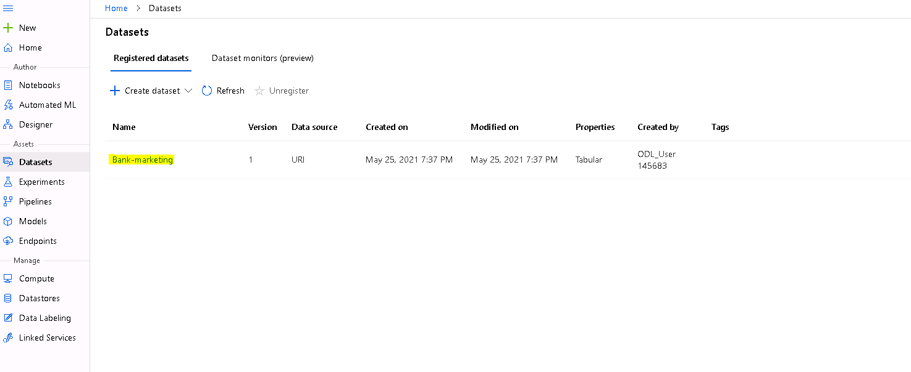
I uploaded the dataset into Azure ML Studio (Registered Dataset Section) using the url provided in the project. 
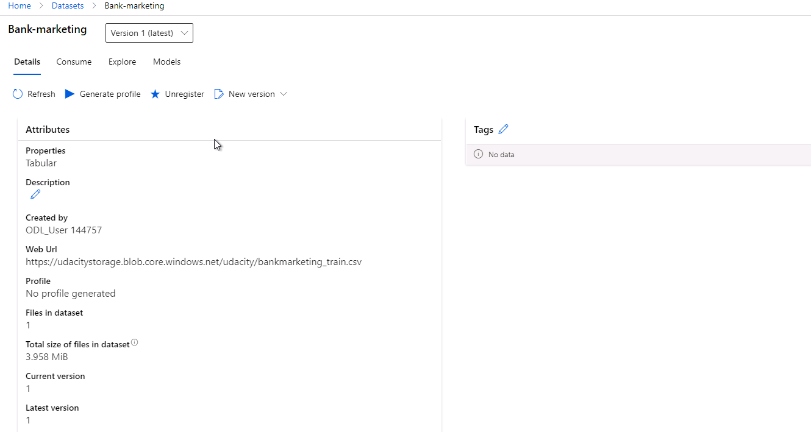

1.2 Create a compute instance: I used the Standard_DS12_v2 for the Virtual Machine and 1 as the minimum number of nodes.

1.3 Created an AutoML experiment to run using the Bank Marketing Dataset which was loaded in the Azure Workspace, choosing 'y' as the target column. 
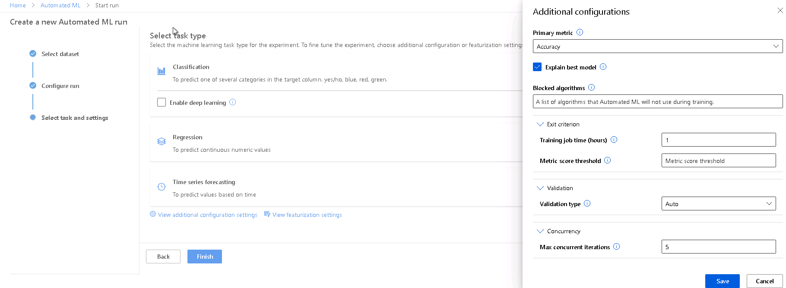 

1.4 I ran the model choosing classification as the modeling approach, accuracy for selecting the best model, and reducing Exit Criterion to 1 hour and Concurrency to 5 concurrent iterations max. 
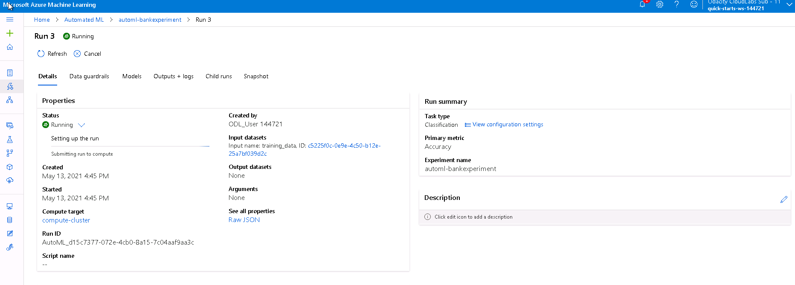

1.5 automl is completed 
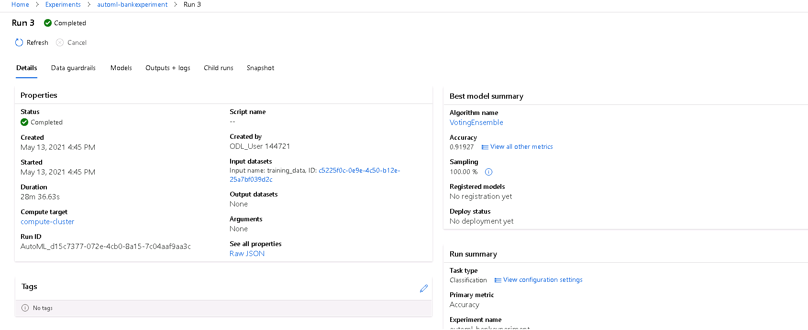

1.6 automl best model and best model's metric is found
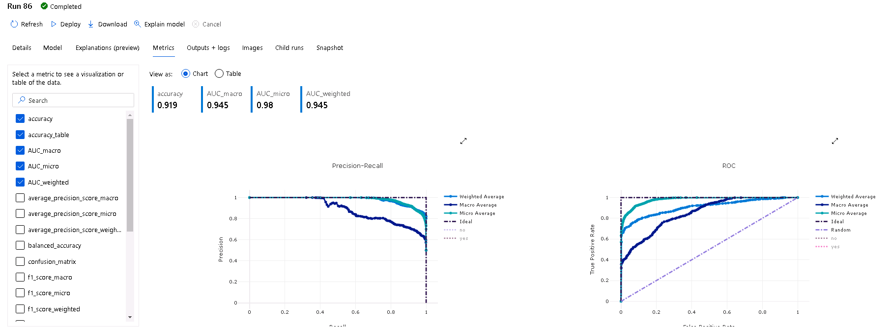

### Step 2: Deploy the best model
To work and interact with the best model we should deploy it. After the deployement is finished it will send us a url where we can send our test data to.

2.1 first select the best model and deploy it through ACI. check the status of deployement that is running 
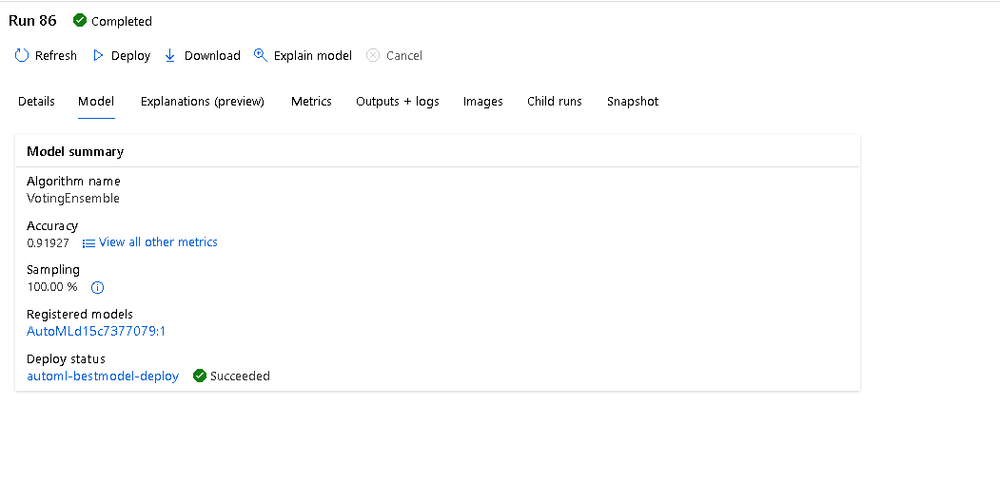
 
2.2 The model is successfully deployed, and we can access the model endpoint in the Endpoints. 
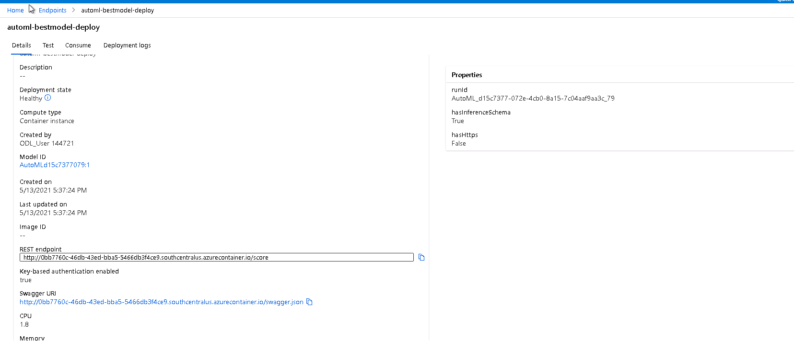 

### Step 3: Enable application insight
Once you have deployed an ML model, you need to monitor the model's performance—which you can do using Microsoft Azure's Application Insights. Application Insights is an Application Performance Management (APM) service that is available as a feature of Azure Monitor. Such as:

- Request rate: The request rate allows you to figure out how many times your model is being called. If it's being called quite frequently, you may want to have a larger cluster.

- Response time: For example, if your application is getting very long response times and it's doing computer vision, you might need to switch to a GPU inference end point.
Failure rate. If your application is failing more than it should (e.g., it has a 20% failure rate) this is something that you may be able to address with an infrastructure change or by using a different model.

- Exceptions: You may train a new mode and put it into production, but then find it doesn't fit with the data structure of what your request is expecting—a situation like this will generate an exception, which you can then address.

Now that the Best Model is deployed, enable Application Insights and retrieve logs. Although this is configurable at deploy time with a check-box, it is useful to be able to run code that will enable it for you.

3.1 create a log.py

3.2  make sure az login works 
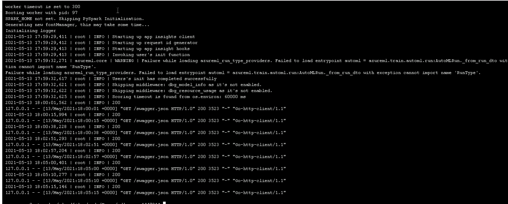 

3.3 name your deployement and open a terminal and run logs.py

3.4 By running the logs.py script, we enable Application Insight.
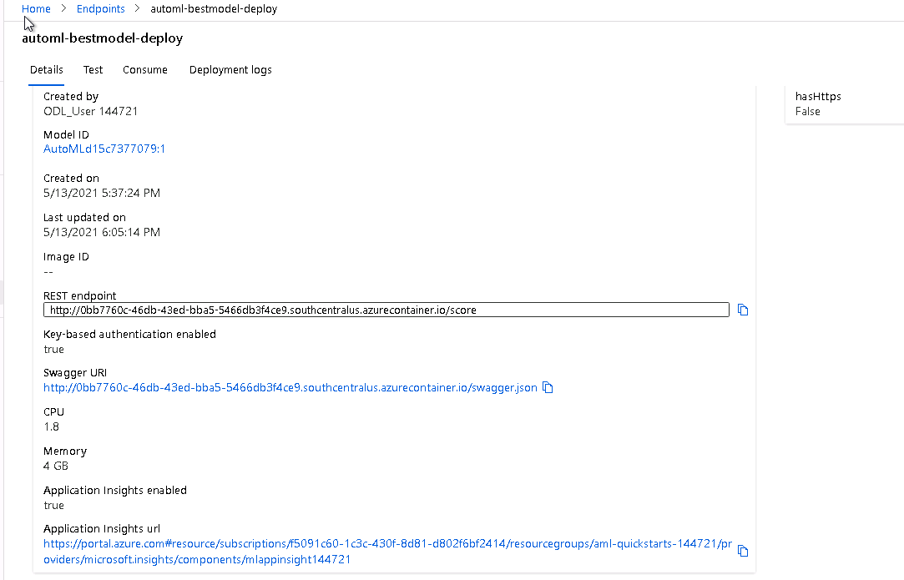 

## step 4: Swagger Documentation
4.1.go to endpoint and copy the swagger url

4.2 open the swagger url and right click and save as swagger.json in the same folder as swagger 
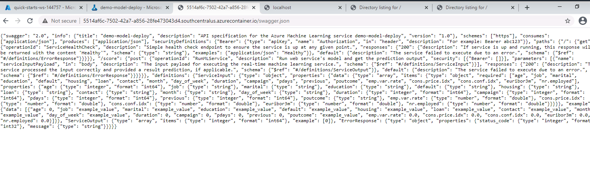 

4.3 open the swagger.sh and change the port to 9000. The port "8080" is an internal port of the swagger-ui docker container, that we don't change. we modify the swagger.sh file to use port 9000

4.4 Run doocker: got to the swagger folder, in the terminal/git bash write bash swagger.sh, this will run swagger.sh 

 
 
 

4.5 the you go to http://localhost:9000 you will see another project 
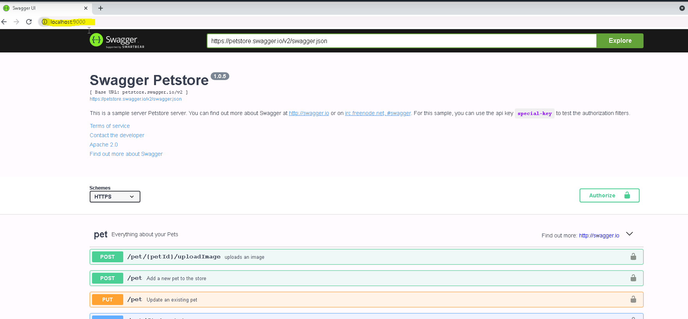 

4.6 go to the swagger folder, open another git bash, make sure serve.py is there and uses port 8000 and run python serve.py. now go to the http://localhost:9000 and type http://localhost:8000/swagger.json in the explorer 

4.7 after running .py the project will be shown in the swagger 
 

4.8 after runnin you can see the model detail in the swagger:
 

## step 5: Consume model endpoints

5.1 go to endpoints, click on the consume

5.2 take the key and rest endpoint

5.3 ran the endpoint.py script to get inference from the deployed model.
  

 
## step 6: Create, Publish and Consume a Pipeline
For this step, I used the aml-pipelines-with-automated-machine-learning-step Jupyter Notebook to create a Pipeline. I created, consumed and published the best model for the bank marketing dataset using AutoML with Python SDK. After updating the notebook to have the same keys, URI, dataset, cluster, and model names already created, I run through the cells to create a pipeline.

6.1 go to the AzureML studio > notebook: upload all starter files. 
 
6.2 make sure all the names are alligned with the experiment we just created. make sure the config.json file is uploaded
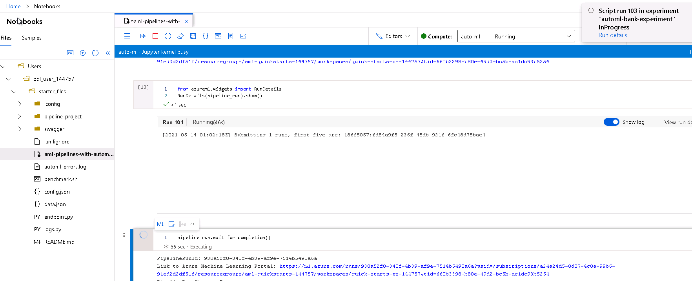
 
6.3 go to the pipline and check the pipline is completed 
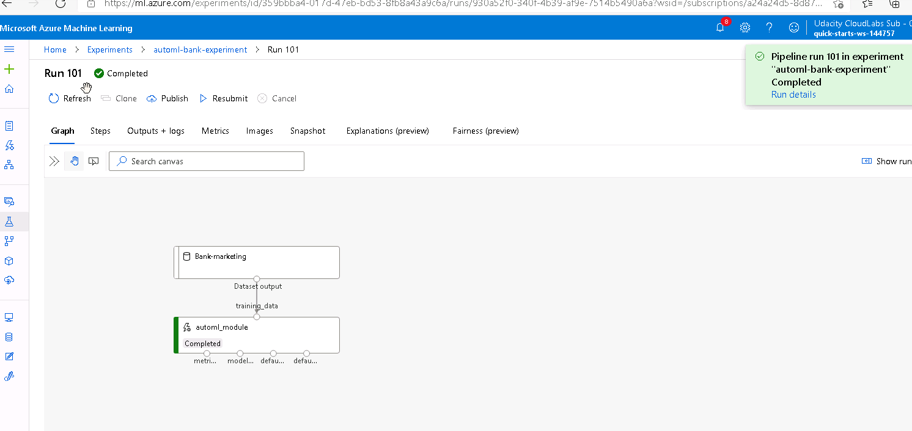
 
6.4 go to the pipline and check the pipline click on the experiment completed 
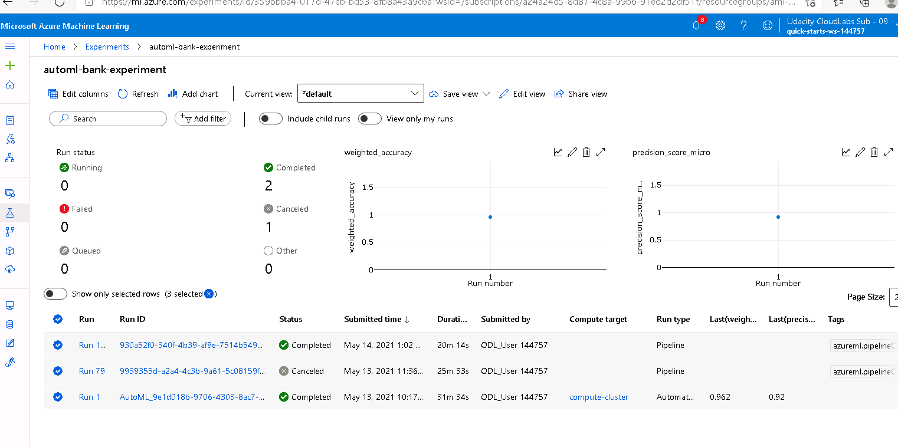
 
6.5 after the pipline is completed, we can publish the pipline and this will enables a REST endpoint to rerun the pipline from any httplibrary fro any platform. 
Get the REST url from the endpoint property of the published pipeline object. You can also find the REST url in your workspace in the portal. Build an HTTP POST request to the endpoint, specifying your authentication header. Additionally, add a JSON payload object with the experiment name and the batch size parameter. As a reminder, the process_count_per_node is passed through to ParallelRunStep because you defined it is defined as a PipelineParameter object in the step configuration.
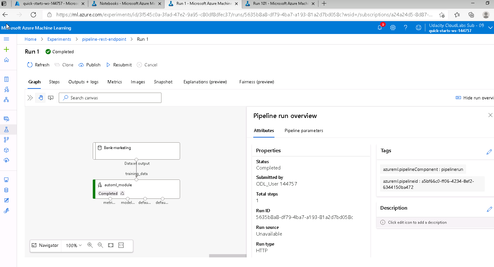

## Future Improvements
1. As we have enough features and we have not taken the complexity of features in to account, it would be a good suggestion to enable DeepLearning as well. although it may take time, but it worth checking the performance and the complex patterns that DL may learn
2. We have chosen the exit criterion to be 1hr, however increasing it to 3-5 hrs may improve the accuracy
We can increase the Exit Criterion time from 1 hour to the default value of 3 hours to be able to find models of higher accuracy.

